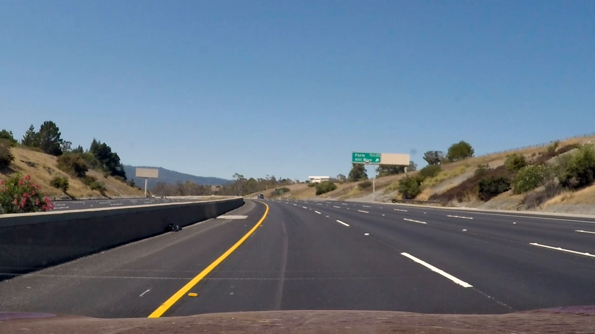
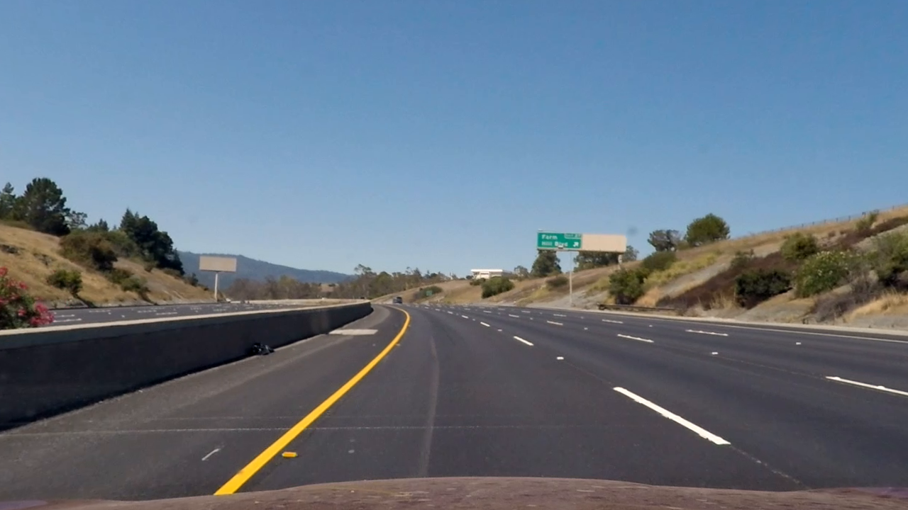
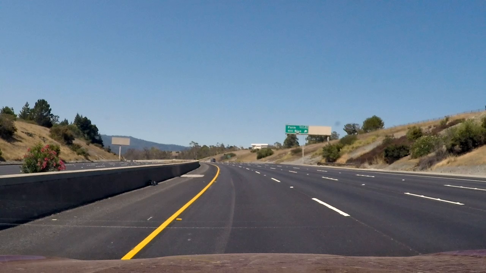
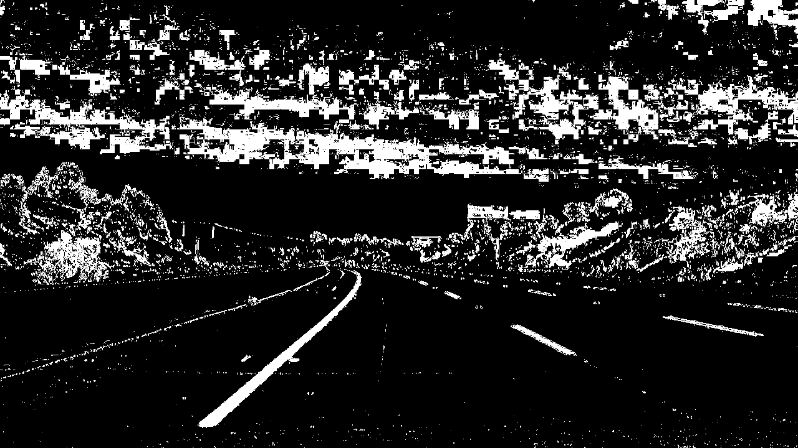
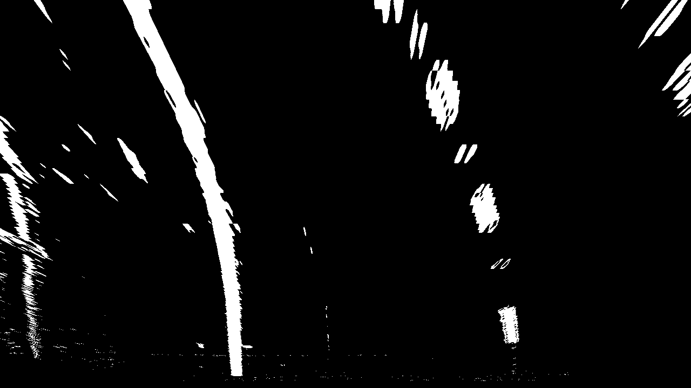
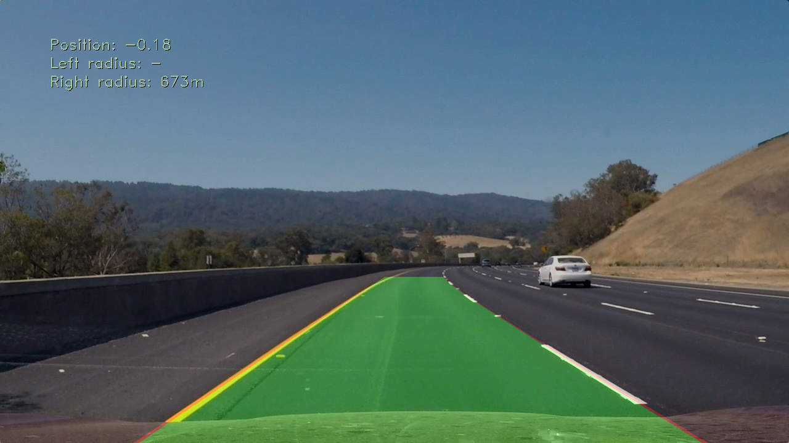

# Writeup 

## Advanced Lane Finding Project

The goals / steps of this project are the following:

* Compute the camera calibration matrix and distortion coefficients given a set of chessboard images.
* Apply a distortion correction to raw images.
* Use color transforms, gradients, etc., to create a thresholded binary image.
* Apply a perspective transform to rectify binary image ("birds-eye view").
* Detect lane pixels and fit to find the lane boundary.
* Determine the curvature of the lane and vehicle position with respect to center.
* Warp the detected lane boundaries back onto the original image.
* Output visual display of the lane boundaries and numerical estimation of lane curvature and vehicle position.

# Camera Calibration

## 1. Briefly state how you computed the camera matrix and distortion coefficients. Provide an example of a distortion corrected calibration image.

The camera code is in the file `src/camera.py`.
There is a Camera object. To calibrate the camera, you have to call the `calibrate` method of a Camera instance passing the glob path of the images to use in the calibration.

The `calibrate` method iterates over all the images. For each image:
* it reads the image 
* it transforms the image to grey scale
* it tries to find the chessboard corners with `cv2.findChessboardCorners`, and if found, it stores them in an array `imgpoints``

Then it uses the corners previously found with `cv2.calibrateCamera` to generate the parameters to be able to undistort images.

The Camera class has another method `undistort` that receives an image and calls `cv2.undistort` with the previous calculated parameters.

# Pipeline

## Provide an example of a distortion-corrected image.
Original chessboard:

Undistorted chessboard:


Original photo:


Undistorted chessboard:


## Describe how (and identify where in your code) you used color transforms, gradients or other methods to create a thresholded binary image. Provide an example of a binary image result.

The code for color transforms is in `src/imagetrans.py`.

The function `to_binary_img` transforms an image into a binary image. The steps of the transformation are the following:

* converto to HSL  and extract ligthness and saturation channels.
* calculate SobelX on the lightness channel. The threshold used for SobelX was (40, 120)
* a threshold is applied on the saturation channel with values in the range (150, 255)
* and the same is done on the lightness channel with the range (40, 255)
* the final binary for whites is formed with the previous in this way: `(sobelx_binary | s_binary) & l_binary``
* on the other side, to capture yellow lines, the image is transform to LAB and a mask is used with a low threshold of (0,95,155) to high threshold of (255,160,255).
* the final images is computed as `(yellow_binary | white_binary)``

Original photo:

Binary:


## Describe how (and identify where in your code) you performed a perspective transform and provide an example of a transformed image.

In the `Camera` object in `src/camera.py`, has a function `prepare_perspective` to calculate the the values for warping:
```def prepare_perspective(self, original_pts, dst_pts):
        self.M = cv2.getPerspectiveTransform(original_pts, dst_pts)
        self.M_inv = cv2.getPerspectiveTransform(dst_pts, original_pts)
```

Then two other methods are exposed, one to warp the images prior lane line calculations and another to draw the calculates lines on the original images.

```    def warp(self, img):
        warped = cv2.warpPerspective(img, self.M, (img.shape[1], img.shape[0]), flags=cv2.INTER_LINEAR)
        return warped

    def unwarp(self, img):
        warped = cv2.warpPerspective(img, self.M_inv, (img.shape[1], img.shape[0]), flags=cv2.INTER_LINEAR)
        return warped
```

The calibration is done from the notebook:
```
original_pts = np.array([ [244,  702], [595,  450], [685,  450], [1046, 702]], np.float32)
dst_pts = np.array([ [400,  702], [400,  0], [880,  0], [880, 702]], np.float32)

camera.prepare_perspective(original_pts, dst_pts)
```

Binary:


Warped binary:



## Describe how (and identify where in your code) you identified lane-line pixels and fit their positions with a polynomial?

Depending whether a previous line can be used, different approaches are used in a code like this for each line:
```
if prev_fit is not None:
        left_fit, lx, ly = search_around_poly(warped_binary, prev_fit)
//if no fit could be found:
if fit is None:
        left_fit, lx, ly, rectangles, le = find_and_fit_polynomial(warped_binary, left=True, margin=75)
```

The first approach `search_around_poly` captures the pixels around the last found line (50px to each side) and tries to fit a polynomial.

The second approach `find_and_fit_polynomial`, uses the histogram approach. It finds the pikes in the histogram of points near the base of the image and starts building sliding rectangles upwards to capture the pixels of the line. With this pixels, it tries to fit a polynomial.

For the polyfit, I've used both np.polyfit and scykit Ransac
```
def polyfit(y, x, full=True):
    return np.polyfit(y, x, 2, full=True)[0]
```

The Ransac version did not provide better results, at least with the default parameters. I tried to explore some parameters, but results didn't improve.

```
from sklearn import linear_model

def polyfit(y, x, full=True):
    y2 = [[el**2, el] for el in y]
    model_ransac2 = linear_model.RANSACRegressor(linear_model.LinearRegression())
    model_ransac2.fit(y2, x)
    fit = np.append(model_ransac2.estimator_.coef_, model_ransac2.estimator_.intercept_)
    return fit
```

## Describe how (and identify where in your code) you calculated the radius of curvature of the lane and the position of the vehicle with respect to center.

Given that these are known, either by docs or measuring on the warped image:
```
lane_width_meters = 3.7 #m
dash_length_meters = 3 #m
lane_width_pixels = 487
dash_length_pixels = 68
```
The mx and my are defined as:
```
mx = lane_width_meters/lane_width_pixels
my = dash_length_meters/dash_length_pixels
```

The fit values are known for pixels.
```
x_px = a * y_px **2 + b * y_px + c
```

We want to work in meters:
```
x_m = A * y_m **2 + B * y_m + C
```
So, using mx and my to converto from pixels to meters on the vertical and horizontal axis we get that:
```
A = a * (mx/(my**2)) 
B = b * mx / my
C = c * mx
```
And given that `y_m = y  * my`, adapting the formula of the course we get that the radious is
```
radius = ((1+(2*A*y_m + B)**2)**1.5)/abs(2*A)
```

The value of y, in pixels, used to calculate the radius is 700, the height of the warped image.

## Provide an example image of your result plotted back down onto the road such that the lane area is identified clearly.

Warped binary:



## Provide a link to your final video output. Your pipeline should perform reasonably well on the entire project video (wobbly lines are ok but no catastrophic failures that would cause the car to drive off the road!)

Videos:

* [Project video](https://drive.google.com/file/d/1rX9fnlVw4NT9QDngvsELJX5QgMfgB7Kx/view?usp=sharing)
* [Challenge video](https://drive.google.com/file/d/1wflLk3nW2E42pFPjoqxhCmMDAASNPyiA/view?usp=sharing)
* [Harder challenge video](https://drive.google.com/open?id=1ij90sblcX21TiIhLoB5F0gWbLSJpmEDk)

Videos with debug information:
* [Project debug video](https://drive.google.com/open?id=1CcQwJWaJqH4T_eU7LavD6V9ykb9pc8Xp)
* [Challenge debug video](https://drive.google.com/open?id=129b7iZL8tnVvqMtVnx7sx67PE5UlHOsE)
* [Harder challenge debug video](https://drive.google.com/open?id=1Ss1rXHeNDt1-ivNJ-JFynStNSeB2ms_N)


## Briefly discuss any problems / issues you faced in your implementation of this project. Where will your pipeline likely fail? What could you do to make it more robust?

The main problem I've found is finding clearly the lines of the road with the image manipulation techniques. There are many edge cases where it fails, with too low contrast, dark images, too much light, etc. It's a trial and error search and when the parameters are tuned to a few examples it fails in others. In particular, marks lines on the road, other cars, lane separators can generate potencial lines that will confuse the system.

Another problem is that the radii of the lines differ more than the lane width. This differences should be strongly smoothed before deciding how to steer the car. The average between both lines seems to be better.

I think there are few big ways to improve to identify the lanes. 

The first one is to use different sensors (radar, lidar) or another camera to be able to understand the image in a 3D context. Once this is understood, it would be easier to find the plane that is the road and only look there for the lanes. This would leave out the noise of other elements like cars, trees, lane speratarors, etc

Another one would be to know the speed of the car. With this information, it would be easier to combine different frames and generate better lines. For instance, dashes that just went behind the car could be use to better predict where are the lines. 

The techniques used for line detection using gradient and masks are also quite brittle. Using our vision we can intuitively predict much better where are the lines, so maybe using deep learning a better result could be achieved.


